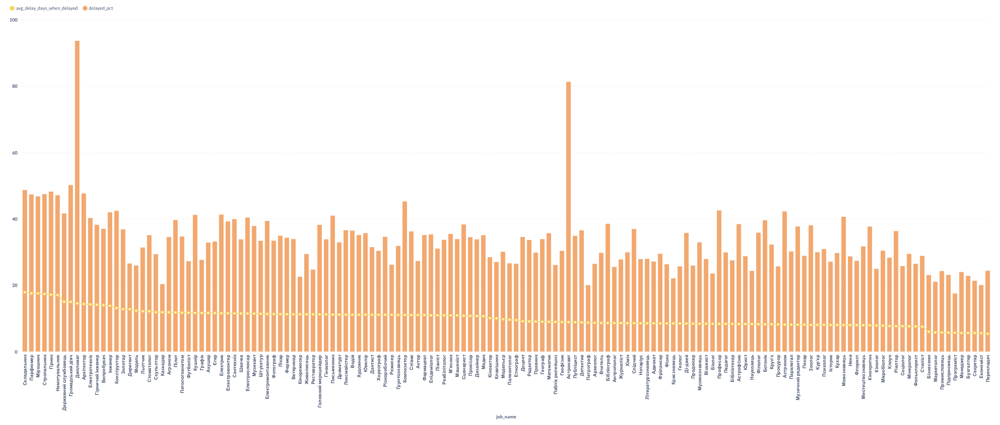
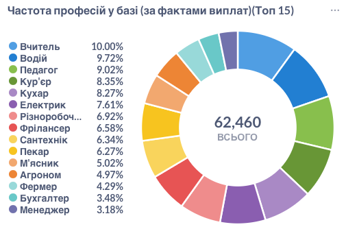
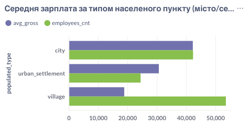
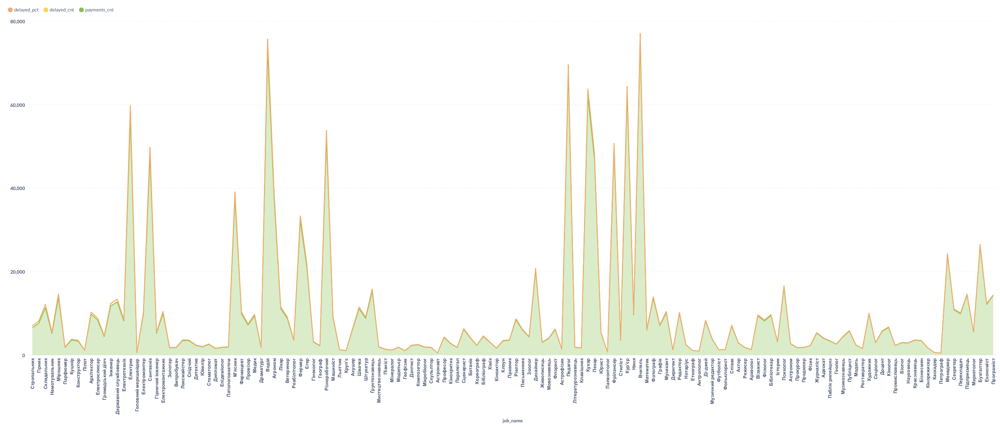
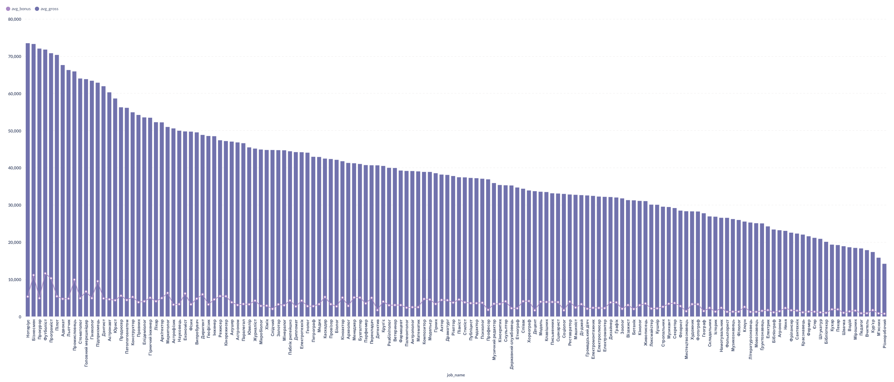
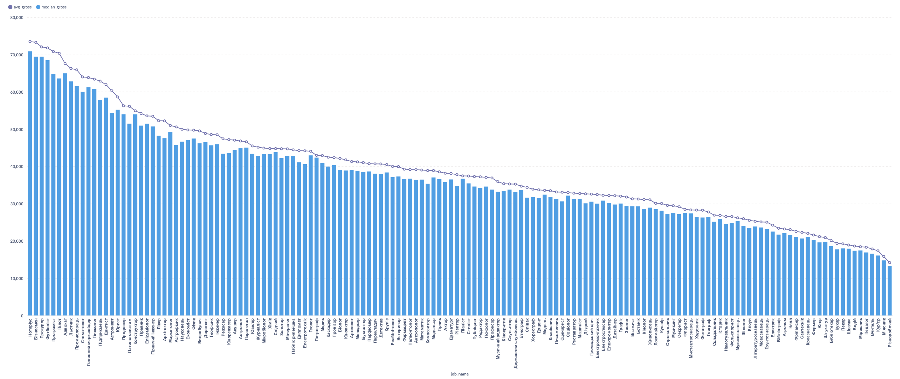
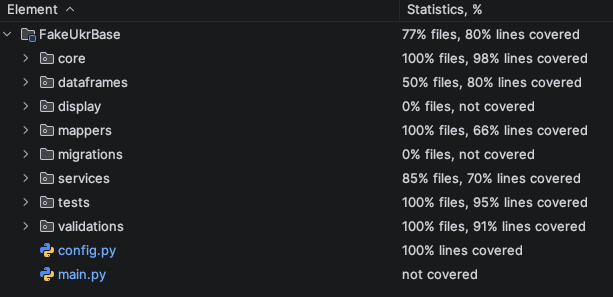

# FakeUkrBase

Synthetic Ukrainian employee dataset generator with database storage, OLAP pipeline, and BI analytics support.

---

## Features

- Generate realistic synthetic Ukrainian personal & employment data  
- Salary simulation (delays, bonuses, penalties included)  
- Export to **Parquet / CSV / XLSX**
- PostgreSQL relational storage with **Alembic migrations**
- ETL - ClickHouse for OLAP analytics  
- BI dashboards via Metabase  

---

## Installation

1.
```bash
git clone https://github.com/olefinbrabus/FakeUkrBase
cd FakeUkrBase
python -m venv .venv && source .venv/bin/activate
pip install -r requirements.txt
```
2. visit site https://data.humdata.org/dataset/ukraine-populated-places
3. download ukr-populated-places.xlsx and put in FakeUkrBase/core/ukraine/
Copy environment config:
```bash
cp .env.example .env

```
Edit .env to match your local setup.

---

## Run Infrastructure

Requires Docker.
```bash
docker compose up -d
```

Apply DB migrations:

```bash
alembic upgrade head
```

## Usage Examples

Generate employees
```bash```
```bash```
```bash
python main.py generate --count 100 -p abstractemployee --seed 42
```

Save generated data into PostgreSQL

```bash
python main.py save
```

Build OLAP layer in ClickHouse

```bash
python main.py olap --full
```

## Data Model

| Layer       | 	Storage	    | Tables                             |
|-------------|--------------|------------------------------------| 
| Source data | 	PostgreSQL	 | employees, jobs, salaries          |
| Analytics   | ClickHouse   | dim_employee, dim_job, salary_fact |


---

## BI Dashboard MetaBase examples 

### 1

```sql
WITH
s AS (
  SELECT DISTINCT job_id, is_delayed, delay_days
  FROM salary_fact
),
j AS (SELECT DISTINCT job_id, name FROM dim_job)
SELECT
  j.name AS job_name,
  round(avgIf(toFloat64(s.delay_days), s.is_delayed = 1), 2) AS avg_delay_days_when_delayed,
  round(100.0 * avg(s.is_delayed), 2) AS delayed_pct
FROM s
JOIN j ON j.job_id = s.job_id
GROUP BY job_name
ORDER BY avg_delay_days_when_delayed DESC, delayed_pct DESC;
```
### 2

```sql
WITH
s AS (SELECT DISTINCT employee_id, job_id FROM salary_fact),
j AS (SELECT DISTINCT job_id, name FROM dim_job)
SELECT
  j.name AS job_name,
  uniqExact(s.employee_id) AS employees_cnt
FROM s
JOIN j ON j.job_id = s.job_id
GROUP BY job_name
ORDER BY employees_cnt DESC
LIMIT 15;
```

### 3

```sql
WITH
s AS (SELECT DISTINCT employee_id, gross FROM salary_fact),
e AS (SELECT DISTINCT employee_id, populated_type FROM dim_employee)
SELECT
  e.populated_type,
  round(avg(s.gross), 2) AS avg_gross,
  uniqExact(s.employee_id) AS employees_cnt
FROM s
JOIN e ON e.employee_id = s.employee_id
GROUP BY e.populated_type
ORDER BY avg_gross DESC;
```

### 4

```sql
WITH
s AS (
  SELECT DISTINCT employee_id, job_id, month, gross, bonus, penalty, is_delayed, delay_days, pay_date
  FROM salary_fact
),
j AS (
  SELECT DISTINCT job_id, name
  FROM dim_job
)
SELECT
  j.name AS job_name,
  count() AS payments_cnt,
  sum(s.is_delayed) AS delayed_cnt,
  round(100.0 * sum(s.is_delayed) / count(), 2) AS delayed_pct
FROM s
JOIN j ON j.job_id = s.job_id
GROUP BY job_name
ORDER BY delayed_pct DESC, payments_cnt DESC;
```

### 5

```sql
WITH
s AS (
  SELECT DISTINCT employee_id, job_id, month, gross, bonus, penalty, is_delayed, delay_days, pay_date
  FROM salary_fact
),
j AS (
  SELECT DISTINCT job_id, name
  FROM dim_job
)
SELECT
  j.name AS job_name,
  count() AS payments_cnt,
  sum(s.is_delayed) AS delayed_cnt,
  round(100.0 * sum(s.is_delayed) / count(), 2) AS delayed_pct
FROM s
JOIN j ON j.job_id = s.job_id
GROUP BY job_name
ORDER BY delayed_pct DESC, payments_cnt DESC;
```

### 6

```sql
WITH
s AS (
  SELECT DISTINCT employee_id, job_id, month, gross, bonus, penalty, is_delayed, delay_days, pay_date
  FROM salary_fact
),
j AS (
  SELECT DISTINCT job_id, name
  FROM dim_job
)
SELECT
  j.name AS job_name,
  count() AS payments_cnt,
  sum(s.is_delayed) AS delayed_cnt,
  round(100.0 * sum(s.is_delayed) / count(), 2) AS delayed_pct
FROM s
JOIN j ON j.job_id = s.job_id
GROUP BY job_name
ORDER BY delayed_pct DESC, payments_cnt DESC;
```

---
## test coverage

